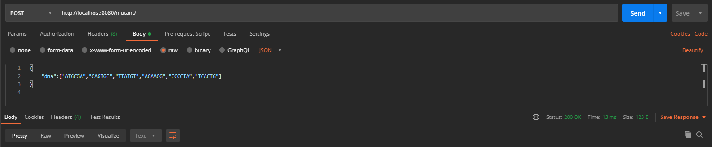
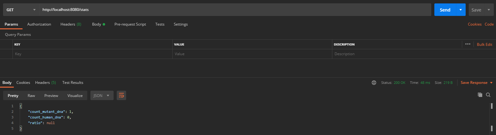
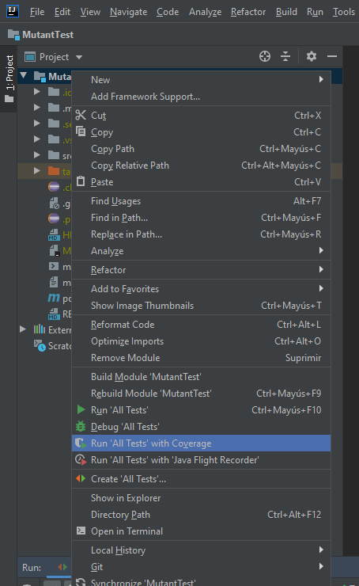

# MutantTest

## Instrucciones de ejecución:
El servicio fue desarrollado con el IDE IntelliJ 2020 ULTIMATE por su integración con SpringBoot.

1. Abrir el proyecto alojado en la carpeta `/MutantTest`
2. Ejecutar la API:

   

---
En caso de utilizar IntelliJ COMMUNITY, u otro IDE, la API puede ser ejecutada a través del siguiente comando Maven:
`mvn springboot:run`
---

3. Ya se puede acceder al servicio a través de localhost 

   `POST:` http://localhost:8080/mutant/
   
   
   
   `GET:`http://localhost:8080/stats
      
   

3. Ejecutar tests con cobertura de código de IntelliJ:

   

  
